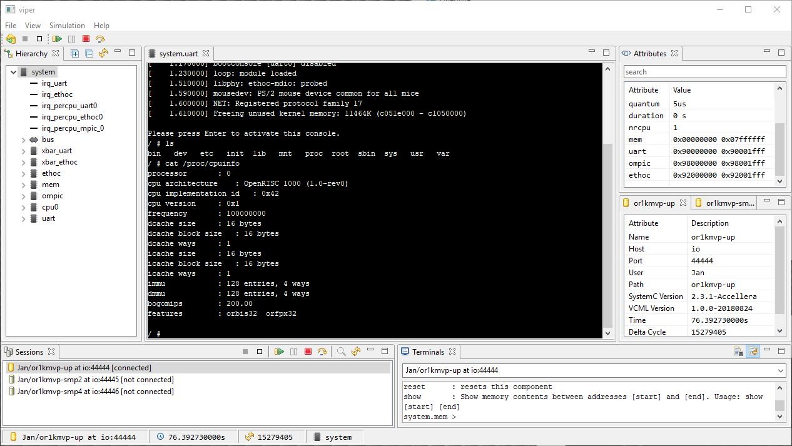
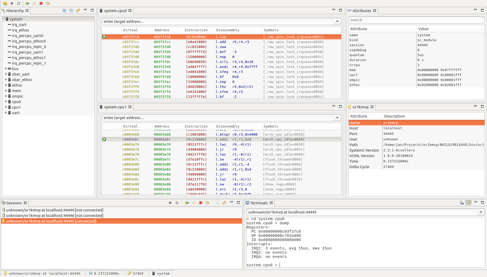

# Virtual Platform Explorer (VIPER)
The **VI**rtual **P**latform **E**xplore**R** `viper` is a gui program used to inspect and
control SystemC simulations built with
[VCML](https://github.com/janweinstock/vcml).

[](https://github.com/janweinstock/viper/actions/workflows/maven.yml)

----
## Build
In order to build `viper` you need a Java `JDK 8` and Apache `Maven` (version 3+).

```
git clone https://github.com/janweinstock/viper.git viper
cd viper
mvn clean verify
```

After the build, your binaries can be found in `product/target/products`.

----
## Pictures

<a href="pictures/uart.png"></a>
<a href="pictures/smp2.png"></a>

----
## License
This project is licensed under the Apache-2.0 license - see the
[LICENSE](LICENSE) file for details.
